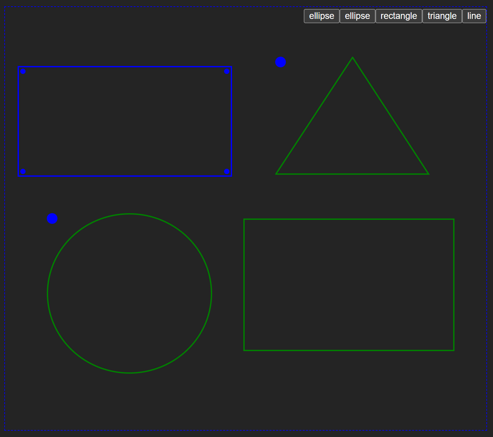

# Wcdraw
<!-- SHOW START -->

<!-- SHOW END -->

> Under active development

**Wcdraw** is a whiteboard drawing tool developed based on web components that can be easily integrated into modern front-end frameworks such as vue, react, svelet, etc.

## Features

- [ ] Developed based on web components and svg

## Shape

- Rectangle
- Triangle
- Line
- Ellipse